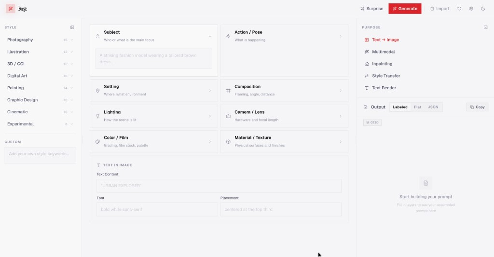
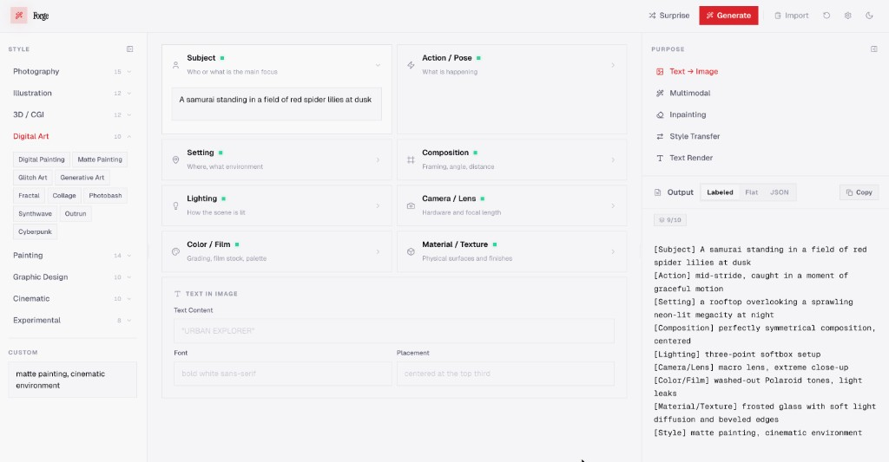
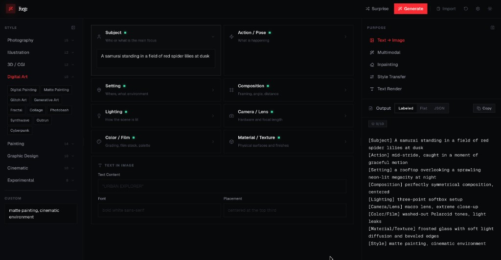
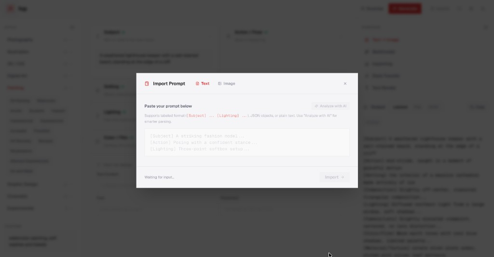
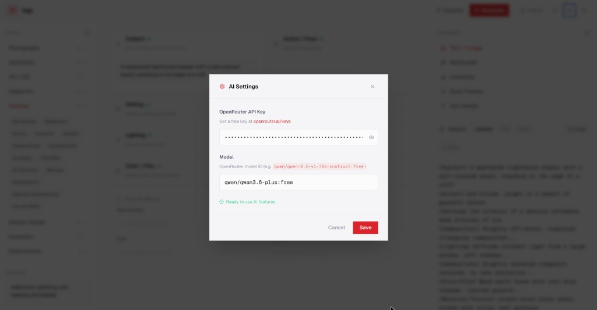

# Forge

Forge is a browser-based **structured prompt builder** for image-generation workflows. You fill in composable layers (subject, setting, lighting, style, and more), pick a **purpose** (text-to-image, multimodal, inpainting, style transfer, text rendering), and see the assembled prompt as **labeled text**, **flat text**, or **JSON**—ready to copy or refine.

## Screenshots

| Light theme — empty workspace | Builder with styles expanded & live preview |
|:---:|:---:|
|  |  |

| Dark theme | Import prompt |
|:---:|:---:|
|  |  |

| AI settings (OpenRouter) |
|:---:|
|  |

## Features

### Layout & workflow

- **Three-column layout** — Resizable **Style** sidebar, central **Builder** canvas, and **Purpose + Output** panel. Side panels can collapse to slim strips on large screens so the builder stays in focus.
- **Header actions** — **Surprise** fills layers at random, **Generate** runs optional AI completion (when configured), **Import** opens the paste modal, plus history, settings, and light/dark theme.

### Style panel (left)

- **Hierarchical style library** — Categories such as Photography, Illustration, 3D / CGI, Digital Art, Painting, and more, each with a count of presets.
- **Expandable categories** — Click a category to reveal sub-style chips (for example Digital Painting, Synthwave, Cyberpunk). Choosing a chip fills the **Style** layer.
- **Custom** — Free-text style keywords when nothing in the library fits.

### Prompt builder (center)

- **Layered modules** — Dedicated fields for **Subject**, **Action / Pose**, **Setting**, **Composition**, **Lighting**, **Camera / Lens**, **Color / Film**, and **Material / Texture**, each with guidance text. Filled layers show a clear “active” state in the UI.
- **Text in image** — For models that render text: **Text Content**, **Font**, and **Placement** so typography in the frame is explicit in the prompt.

### Purpose & preview (right)

- **Purpose** — Pick the task shape: **Text → Image**, **Multimodal**, **Inpainting**, **Style Transfer**, or **Text Render**. Switching purpose can load a matching layer template.
- **Output formats** — **Labeled** (tagged sections like `[Subject] …`), **Flat** (one paste-ready string), or **JSON** (structured data for tooling).
- **Layer progress** — A small **filled / total** indicator shows how many layers currently contribute to the assembly.
- **Copy** — One click copies the current output view to the clipboard.

### Import & AI

- **Import Prompt** — Paste **labeled** text (`[Subject] … [Lighting] …`), **JSON**, or plain text. Optional **Analyze with AI** helps map messy prose into layers when an API key is set.
- **AI Settings** — Bring your own **[OpenRouter](https://openrouter.ai/)** API key and model ID for generate/import assist. Keys stay in the browser (local storage); nothing is sent until you use an AI action.

### Design

- **Typography** — **Geist** for UI, **Instrument Serif** for the wordmark, **Geist Mono** for prompt output.
- **Accent** — Red accent (`#FA2A32`) for primary actions and active states; surfaces and borders use theme tokens with proper opacity in Tailwind.

## Tech stack

| Area | Choice |
|------|--------|
| UI | [React](https://react.dev/) 18 |
| Language | [TypeScript](https://www.typescriptlang.org/) |
| Build & dev server | [Vite](https://vitejs.dev/) 6 |
| Styling | [Tailwind CSS](https://tailwindcss.com/) 3, [PostCSS](https://postcss.org/), Autoprefixer |
| Icons | [Lucide React](https://lucide.dev/) |
| Text layout / height estimation | [@chenglou/pretext](https://github.com/chenglou/pretext) (DOM-free measurement for preview sizing) |

Typography is loaded from Google Fonts: **Geist**, **Geist Mono**, and **Instrument Serif**. Theme colors and surfaces use CSS custom properties composed with Tailwind for light/dark-friendly UI.

## Getting started

**Requirements:** Node.js 18+ (or any version compatible with Vite 6).

```bash
npm install
npm run dev
```

Open the URL Vite prints (usually `http://localhost:5173`).

**Production build:**

```bash
npm run build
npm run preview   # optional: serve the dist folder locally
```

## Repository

Source and issues: [github.com/h00mankind/Forge](https://github.com/h00mankind/Forge).
